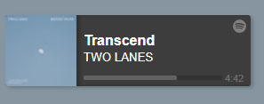

# Svelte Spotify Web Playback
 [](https://www.npmjs.com/package/svelte-spotify-web-playback)
[](https://bundlephobia.com/package/svelte-spotify-web-playback)

A simple svelte wrapper for Spotify web playback. Lets you focus on building your own player
and not needing to worry about the underlying logic/authorizations needed to get things running.
## Features
- Wrapper for [Spotify Web Playback SDK](https://developer.spotify.com/documentation/web-playback-sdk/reference/)
- Built-in authorization with [PKCE](https://developer.spotify.com/documentation/general/guides/authorization-guide/#authorization-code-flow-with-proof-key-for-code-exchange-pkce) + token refresh.
- Exposes token for additional usage on other libraries ex. [Web API](https://github.com/JMPerez/spotify-web-api-js)

## Installation
```bash
npm install -D svelte-spotify-web-playback
```
## Requiments
- A Client ID which can be obtained from Spotify [Dashboard](https://developer.spotify.com/dashboard)
- Authenticated users must have a valid Spotify Premium subscription.
- A [supported web browser](https://developer.spotify.com/documentation/web-playback-sdk/#supported-browsers) running on the user's device

> When creating an Client ID, remember to add correct callback urls to your application. This wrapper will default to it's __current__ url as the callback url. Example when developing, you probaly will host the player on https://localhost:3000/ -> you should have this url in callbacks.

## Simple usage
This simple version will render the basic player with few controls.
```html
<script>
  import { WebPlayback } from 'svelte-spotify-web-playback';
  const client_id = 'your_client_id';
</script>

<WebPlayback {client_id} />
```


## Customization
You propably want to customize your player - this is done via [slots](https://svelte.dev/tutorial/slots). 
You can use slots directly or pass it to your custom elements. _(Suggesting the latter, keeps things tidy)_
```html
<script>
  import { WebPlayback } from 'svelte-spotify-web-playback';
  import CustomPlayer from './src/my_custom_player.svelte';
  const client_id = 'your_client_id';
  let wrapper; // Reference to our wrapper element.
</script>

<WebPlayback 
  {client_id} 
  name="My Spotify Player" 
  volume={0.5} 
  bind:this={wrapper}
>
  <!-- Direct usage -->
  <div slot="login">
      <button on:click={() => wrapper.login()}>Login with Spotify</button>
  </div>
  <!-- Custom element usage -->
  <CustomPlayer slot="player" let:player let:state {player} {state} />
</WebPlayback>
```
## Wrapper element 
### Functions
| function | description |
| ------ | ------ |
| `login()` | Login saved user, or redirect to give access to the app. |
| `selectDevice()` | Select this player active |
| `logout()` | Logs current user out. User needs to give access again. |
### Props
| name | default value | type | description|
| ------ | ------ | ------ | ------ |
| _client\_id_ | (required) | `string` |  |
| name | Svelte Web Player | `string` | Name of your player in Spotify Connect |
| volume | 0.5 |`number` | Initial volume of the player |
| scopes | ['user-read-playback-state','streaming','user-read-private','user-modify-playback-state','user-read-email'] |`string[]` | [Scopes](https://developer.spotify.com/documentation/general/guides/scopes/) for your player. |
| redirect_uri | current window url |`string` | The url where your player is located. |
### Slots
| name | props | 
| ------ | ------ | 
| error | `{ error:{ type: string, message: string } }` |
| login | - | 
| loading | - |
| waiting | - |
| player | `{ player: WebPlaybackPlayer, state: WebPlaybackState }` |
| logout | - |
| all | `{ player: WebPlaybackPlayer, state: WebPlaybackState, error: { type: string, message: string }, internal: InternalStatus }` |

Slot "all" is ment for users who want to heavily modify the flow of the player. It will expose the internal state to the user. However, it will disable all other slots - you will need to handle different states manually.

## Examples
TODO: 
- Source of the basic player: [Here](./src/lib/internal/_basicPlayer.svelte)